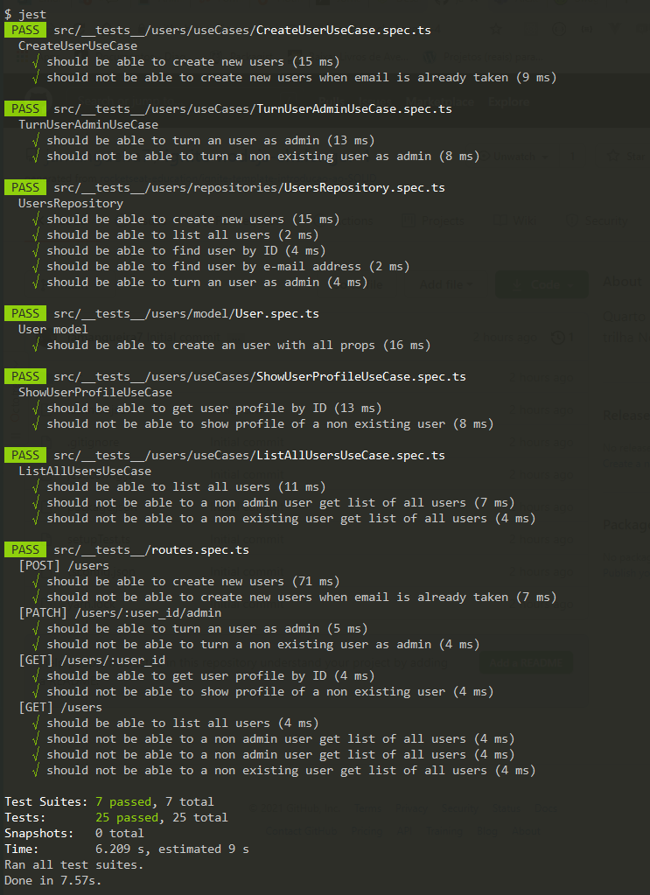

<p align="center">
  <a href="#rocket-tecnologias">Tecnologias</a>&nbsp;&nbsp;&nbsp;|&nbsp;&nbsp;&nbsp;
  <a href="#-projeto">Projeto</a>&nbsp;&nbsp;&nbsp;|&nbsp;&nbsp;&nbsp;
  <a href="#-como-rodar">Como rodar</a>&nbsp;&nbsp;&nbsp;|&nbsp;&nbsp;&nbsp;
  <a href="#-Rotas">Rotas</a>&nbsp;&nbsp;&nbsp;|&nbsp;&nbsp;&nbsp;
  <a href="#-como-contribuir">Como contribuir</a>&nbsp;&nbsp;&nbsp;
</p>

<br>


## Ignite Node.js - Quarto desafio

## 🚀 Tecnologias

Esse projeto foi desenvolvido com as seguintes tecnologias:

- [NodeJS](https://nodejs.org/en/) - 0.63.3
- [Yarn](https://yarnpkg.com/) - 1.22.4
- [Npm](https://www.npmjs.com/) - 6.14.5


## 💻 Projeto

API para cadastrar usuario e fazer o CRUD de tarefas.

Descrição do desafio [Ignite](https://www.notion.so/Desafio-01-Introdu-o-ao-SOLID-3b9be286fac0482ca3b275473ddd2d72)


Resolulção do teste.
<p align="center">
  
</p>

## 🚀 Como Rodar

- Clone o projeto.
- Entre na pasta do projeto e rode "yarn install" (pode usar npm install de acordo com a sua configuração).
- "yarn test" para rodar os testes.
- yarn run dev para rodar o projeto (localhost:3333).

## 👩🏿‍💻 Rotas

- **`POST /users`**: Rota para cadastro de usuario.

Enviar:
```
{
    "name": "João",
    "username": "joao"
}
```
Retorna:
```
{
    id: 'f13a9413-ba30-4e1d-9be1-6ba396bcb3d0',
    admin: false,
    name: '0.04407016819258591',
    email: '0.8971246144254499',
    created_at: '2021-04-04T03:04:29.673Z',
    updated_at: '2021-04-04T03:04:29.673Z'
},
```

- **`GET /users`**: Rota para retornar todos os usuarios se o usuario enviado for administrador.

Enviar:
```
{
    "user_id": "f13a9413-ba30-4e1d-9be1-6ba396bcb3d0",
}
```

Retorna:
```
[
    {
        id: '1a65f7a4-4cd0-48a1-a97d-08b6fcb2af66',
        admin: false,
        name: 'John Doe',
        email: 'john.doe@example.com',
        created_at: '2021-04-04T03:04:29.626Z',
        updated_at: '2021-04-04T03:04:29.626Z'
    },
    {
        id: 'd57a7f50-76df-4f99-a878-d23ad96b3fed',
        admin: true,
        name: '0.33595883684595007',
        email: '0.9187020080476493',
        created_at: '2021-04-04T03:04:29.649Z',
        updated_at: '2021-04-04T03:04:29.652Z'
    }
]
```

- **`GET /users/:user_id`**: Rota para retornar o usuario pelo ID.

Retorna:
```
{
    id: 'd57a7f50-76df-4f99-a878-d23ad96b3fed',
    admin: true,
    name: '0.33595883684595007',
    email: '0.9187020080476493',
    created_at: '2021-04-04T03:04:29.649Z',
    updated_at: '2021-04-04T03:04:29.652Z'
}
```

- **`PATCH /users/:user_id/admini`**: Rota para alterar um usuario para administrador.

Retorna:
```
{
    id: 'd57a7f50-76df-4f99-a878-d23ad96b3fed',
    admin: true,
    name: '0.33595883684595007',
    email: '0.9187020080476493',
    created_at: '2021-04-04T03:04:29.649Z',
    updated_at: '2021-04-04T03:04:29.652Z'
}
```

## 🤔 Como contribuir

- Faça um fork desse repositório;
- Cria uma branch com a sua feature: `git checkout -b minha-feature`;
- Faça commit das suas alterações: `git commit -m 'feat: Minha nova feature'`;
- Faça push para a sua branch: `git push origin minha-feature`.

Depois que o merge da sua pull request for feito, você pode deletar a sua branch.

## 📝 Licença

Esse projeto está sob a licença MIT.
